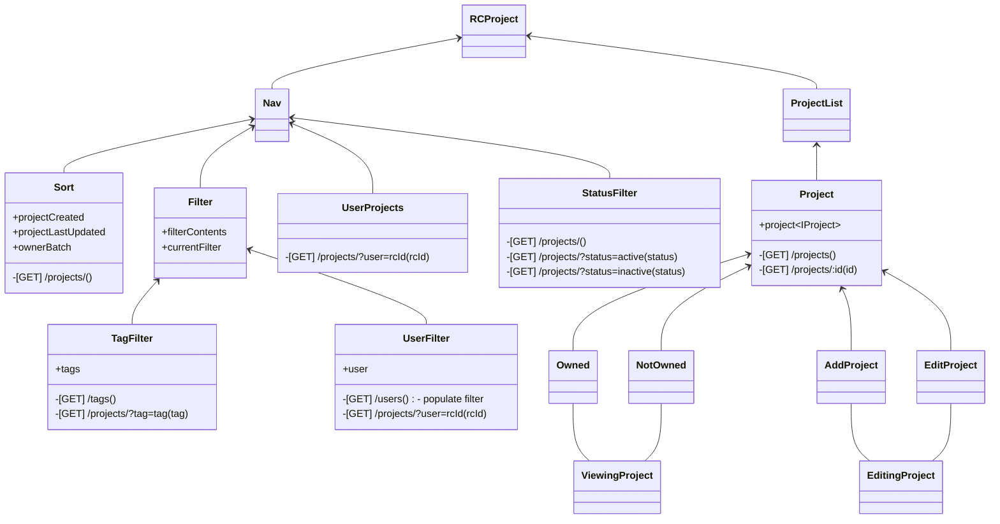

```mermaid
classDiagram
    RC Project <-- Nav
    RC Project <-- Project List

    Nav <--  Sort
    Nav <--  Filter
    Filter <--  TagFilter
    Filter <--  UserFilter
    Nav <--  UserProjects
    Nav <--  StatusFilter
    
    Project List <--  Project
    Project <--  Owned
    Project <--  NotOwned
    Project <--  AddProject
    Project <--  EditProject

    Owned -- ViewingProject
    NotOwned -- ViewingProject
    AddProject -- EditingProject
    EditProject -- EditingProject


    class Nav{
    }

    class Sort{
    +projectCreated
    +projectLastUpdated
    +ownerBatch
    -[GET] /projects/ ()
    }

    class Filter{
    +filterContents
    +currentFilter<tag, user>
    }

    class TagFilter{
    +tags<tag[]>
    -[GET] /tags ()
    -[GET] /projects/?tag=tag (tag)
    }

    class UserFilter{
    +user<rcID>
    -[GET] /users () - populate filter
    -[GET] /projects/?user=rcId (rcId)
    }

    class StatusFilter {
    -[GET] /projects/ ()
    -[GET] /projects/?status=active (status)
    -[GET] /projects/?status=inactive (status)
    }

class UserProjects{
    -[GET] /projects/?user=rcId (rcId)
    }

    class Project List{
    
    }

    class Project{
    +project~IProject~
    -[GET] /projects ()
    -[GET] /projects/:id (id)
    }

    class Owned{
    }
```